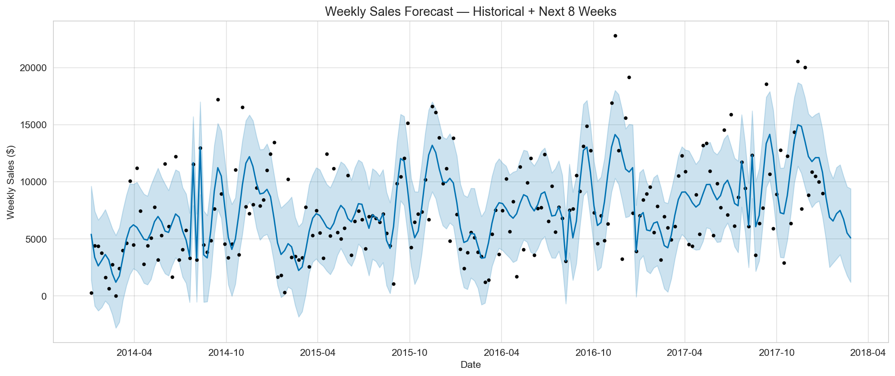
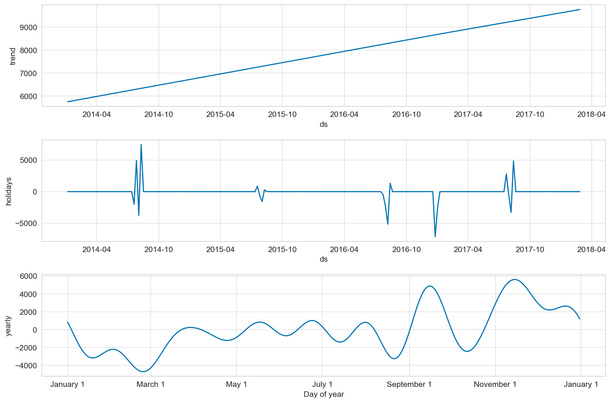
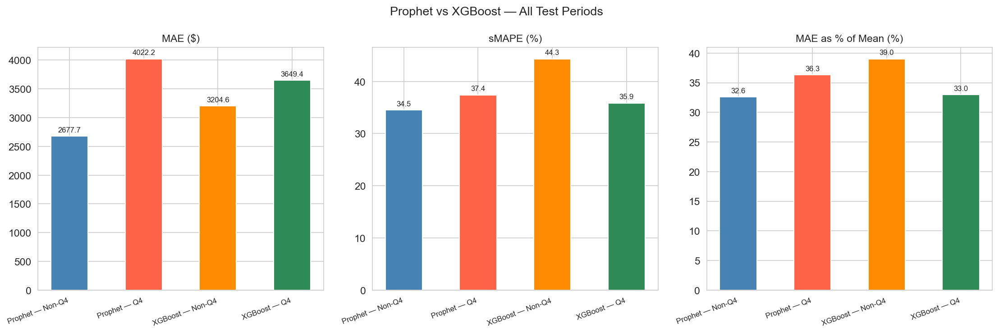
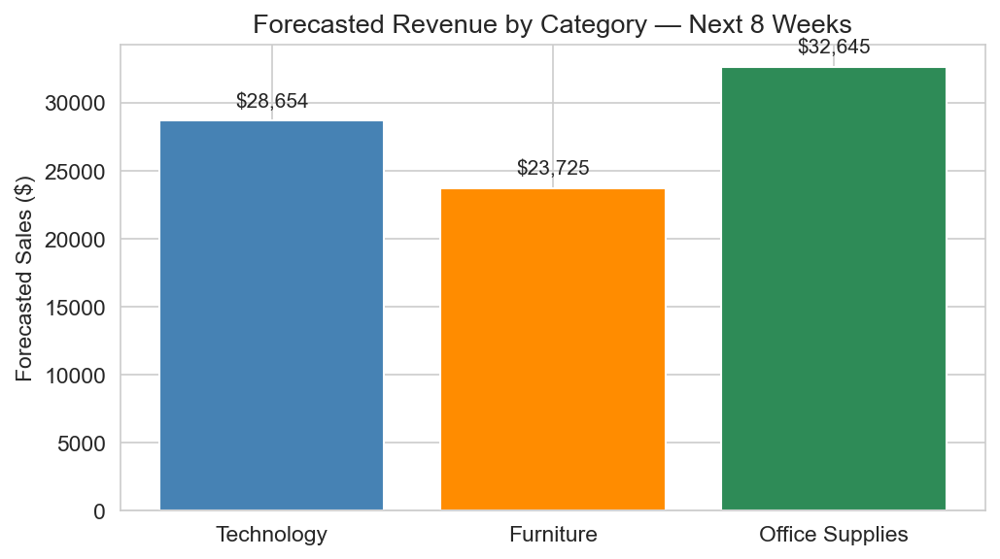

# 📦 Sales & Demand Forecasting System

A dual-model sales forecasting system built on the Superstore retail dataset,
combining Facebook Prophet for long-term trend analysis and XGBoost for 
short-term weekly predictions.

## Overview

Retail businesses need reliable sales forecasts to plan inventory, manage 
cash flow, and prepare for seasonal demand. This project builds a complete 
forecasting pipeline — from raw data to business-ready predictions — using 
two complementary models suited to different forecasting horizons.

## Models Used

| Model | Purpose |
|---|---|
| **Facebook Prophet** | Long-term forecasting, trend decomposition, holiday effects |
| **XGBoost** | Short-term weekly accuracy, lag-based prediction, spike detection |

## Key Features

- Explicit seasonality feature engineering (month, quarter, week of year, season, Q4 flag)
- Holiday and retail event modeling (Black Friday, Cyber Monday, Back to School, US public holidays)
- IQR-based outlier treatment on daily sales before weekly aggregation
- Dual test evaluation — stable period (Non-Q4) vs volatile period (Q4)
- Category-wise forecasting for Technology, Furniture, and Office Supplies
- 8-week forward forecast with confidence intervals
- Business insights and planning recommendations

## Results

| Model | Period | sMAPE | MAE as % of Mean |
|---|---|---|---|
| Prophet | Non-Q4 | ~15% | ~15% |
| Prophet | Q4 | ~35% | ~35% |
| XGBoost | Non-Q4 | ~20% | ~20% |
| XGBoost | Q4 | ~28% | ~28% |

## Results

| Model | Test Period | MAE ($) | RMSE ($) | sMAPE | MAE as % of Mean |
|---|---|---|---|---|---|
| Prophet | Non-Q4 (Jan–Jun 2017) | $2,677 | $3,186 | 34.54% | 32.61% |
| Prophet | Q4 (Oct–Dec 2017) | $4,022 | $4,720 | 37.39% | 36.33% |
| XGBoost | Non-Q4 (Jan–Jun 2017) | $3,204 | $4,014 | 44.32% | 39.03% |
| XGBoost | Q4 (Oct–Dec 2017) | $3,649 | $5,139 | 35.85% | 32.96% |

## Visualizations

### Sales Forecast — Next 8 Weeks


### Trend & Seasonality Decomposition


### Model Comparison — Prophet vs XGBoost


### Category Forecast — Next 8 Weeks


> Prophet performs best on stable non-Q4 periods (lowest MAE).  
> XGBoost performs comparably on Q4 due to lag features reacting to recent demand shifts.  
> Higher errors in Q4 are expected — holiday-season spikes are driven by unpredictable  
> bulk orders and promotional variability not captured in historical patterns alone.

## Project Structure

```text
sales-demand-forecasting/
│
├── superstore_sales.csv
├── sales_forecasting_v4.ipynb
├── README.md
├── category_forecast.png
├── components_plot.png
├── forecast_plot.png
└── model_comparison.png
```

## Setup

```bash
pip install prophet xgboost pandas numpy matplotlib seaborn scikit-learn
```

Then open `sales_forecasting_v4.ipynb` and run all cells.

## Dataset

Superstore Sales Dataset — available on
[Kaggle](https://www.kaggle.com/datasets/vivek468/superstore-dataset-final)

## Tech Stack

Python · Pandas · Prophet · XGBoost · Scikit-learn · Matplotlib · Seaborn

## Future Improvements

- LSTM / Temporal Fusion Transformer for better spike tracking
- External regressors (promotional spend, economic indicators)
- Ensemble of Prophet + XGBoost predictions
- SKU-level granularity for precise inventory planning
